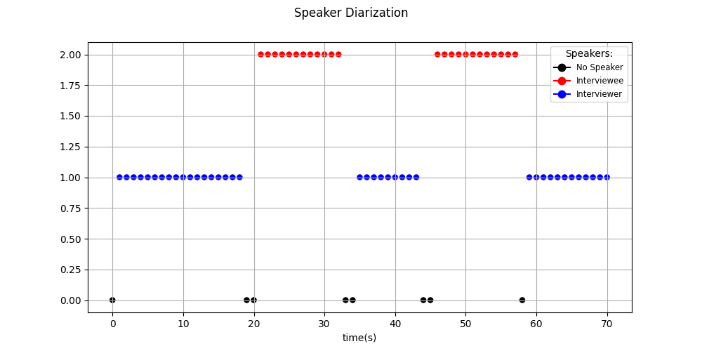

# Speaker Diarization Project

This repository contains the code and resources for a speaker diarization project. Speaker diarization is the task of segmenting an audio recording into homogeneous regions based on speaker identities. 
This project aims to develop a speaker diarization for two speakers using unsupervised deep learning, in the form of neural network and clustering. 

## Project Structure

The repository is organized as follows:

- `data/`: This directory contains the audio data used for training and evaluation. 
- `src/`: This directory contains the source code for the speaker diarization system. It includes the following classes and their functionalities:
  - `Diarization`: Applying speaker diarization on data, with several options
  - `Visualization`: Generate a diarization plot and .mp4 clip of animation of the speakers by time with the audio. 
  - `noise clean`: Noise cleaning filters to be applied on audio. 
  - `help_func`: Utility functions for diarization 
- `pretrained_models/`: Pretrained models or checkpoints that can be used for inference or fine-tuning. It is recommended to download from Hugging Face. 
- `utils/`: Utility scripts and helper functions used throughout the project.
- `LICENSE`: The license file for this project.
- `README.md`: This file, providing an overview of the project and instructions for getting started.


## Getting Started

To get started with this project, follow the steps below:

1. Clone the repository:
    ```
    git clone https://github.com/n242/HBL.git

    ```
2. Make sure you have python 3.8+ installed 

3. Install the required dependencies. Please refer to the `requirements.txt` file for the list of dependencies. You can install them using the following command:
    ```
    pip install -r requirements.txt
    ```

4. Download or prepare the audio data for diarization and evaluation. Place the data in the `data/` directory following the instructions provided in the `data/README.md` file.

5. Train a model or download one from Hugging Face (see instructions below)

6. Add your input path to main.py and run the speaker diarization code, visualize the data.

## Use pre-trained module from Hugging Face
1. visit hf.co/pyannote/speaker-diarization and hf.co/pyannote/segmentation and accept user conditions (only if requested)
2. visit hf.co/settings/tokens to create an access token (only if you had to go through 1.)
3. Insert your auth_token to main.py. 


## Example Interview
You can view an example output of an interview between two speakers.



And the full video at: 
[example interview](visual_outputs/animation_example.mp4)


## Using the repository

When generating the .csv we assume the interviwer opens the interview. 

## Contribution Guidelines

Contributions to this project are welcome. If you encounter any issues or have suggestions for improvements, please feel free to submit an issue or a pull request. 

## License

This project is licensed under the [MIT License](LICENSE).

## Acknowledgements
We relied upon the following:

[pyannote-audio](https://github.com/pyannote/pyannote-audio/)

[noisereduce](https://github.com/timsainb/noisereduce/)

## Authors
[Neta Oren](https://github.com/n242/) and [Faisal Omari](https://github.com/faisalomari/)
 This project was part of the Computational Research of Human Behavior course as part of their M.Sc and B.Sc. in Computer Science at the University of Haifa.
The project was performed under the supervision of [Prof. Hagit Hel-Or](https://cs.haifa.ac.il/~hagit/). 

